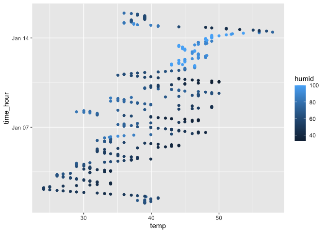

p8105_hw1_jg5038
================
Julia Gray
2025-09-11

``` r
library(moderndive)
library(ggplot2)
library(tidyverse)
```

## Problem 1

``` r
data("early_january_weather")
```

The variables in this dataset are origin, year, month, day, hour, temp,
dewp, humid, wind_dir, wind_speed, wind_gust, precip, pressure, visib,
time_hour.

In the year column we can see that the data covers 2013 during the 1st
month of the year for 15 days.

The size of the dataset is 358 rows x 15 columns

The mean temperature is 39.5821229

Here is a scatterplot of temp (y) vs time_hour (x):

``` r
ggplot(early_january_weather, aes(x=temp, y=time_hour, color=humid)) + geom_point()
```

<!-- -->
From the plot we can see that there is a cycle of temperature during the
day with higher temperatures observed around midday and humidity going
up with temperature. We can also see that the temperature rises as the
month progresses with temperatures at the end of the month higher than
at the beginning.

``` r
ggsave("early_january_weather_plot.png")
```

## Problem 2

### Create tibble:

``` r
var_types_df = tibble(
  random_samp = rnorm(10),
  logical_vector = random_samp>0,
  char_vector = c('hello', 'goodbye', 'hello', 'hello', 'goodbye', 'goodbye', 'hello', 'goodbye', 'hello', '!'),
  factor_vector = factor(char_vector, levels = c("hello", "goodbye", "!"))
)
```

### Take the mean of all the columns and see what works:

1.  Taking the mean of the random sample works and is -0.4620606
2.  Taking the mean of the logical vector also works and is 0.3
3.  Taking the mean of the character vector does not work and returns NA
4.  Taking the mean of the factor vector does not work and returns NA

### Try to convert variables from 1 type to another

``` r
test_numeric_logical = as.numeric(pull(var_types_df, logical_vector))
test_numeric_char = as.numeric(pull(var_types_df, char_vector))
```

    ## Warning: NAs introduced by coercion

``` r
test_numeric_factor = as.numeric(pull(var_types_df, factor_vector))
```

It is possible to convert the logical and factor vectors to numbers
using the as.numeric function but not the character vector. This
explains why it is possible to take the mean of these columns even
though they are not explicit numbers to start with.
